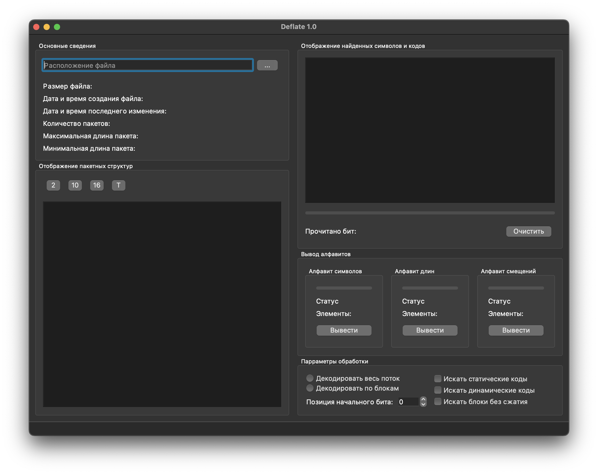
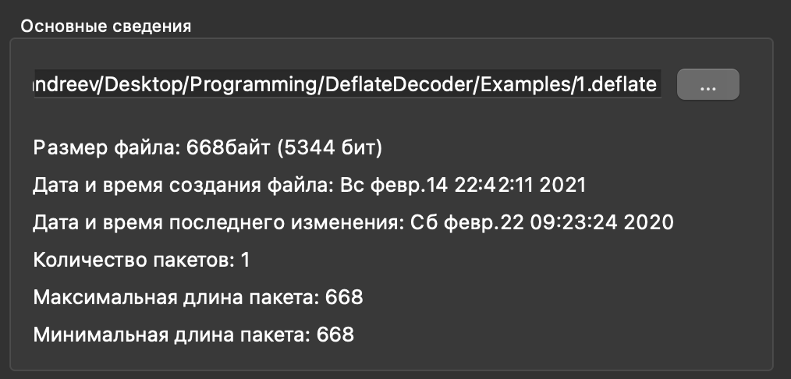
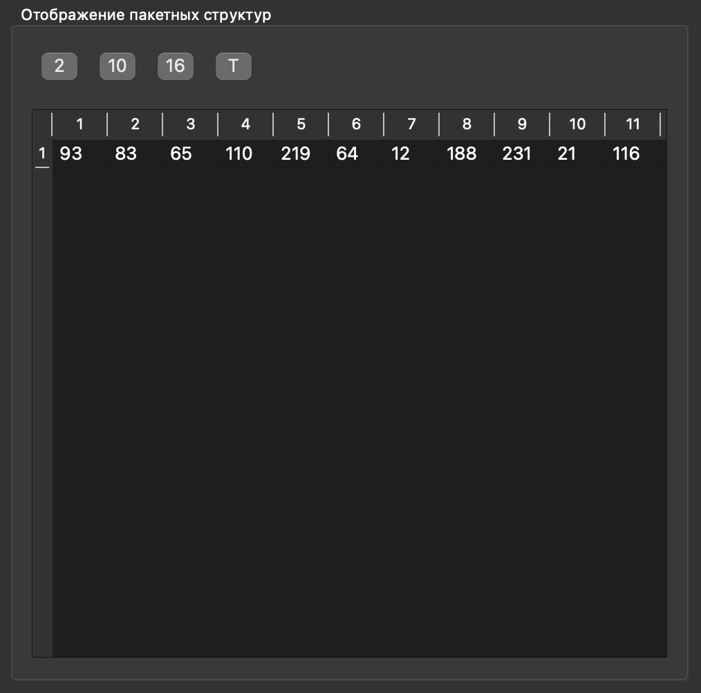
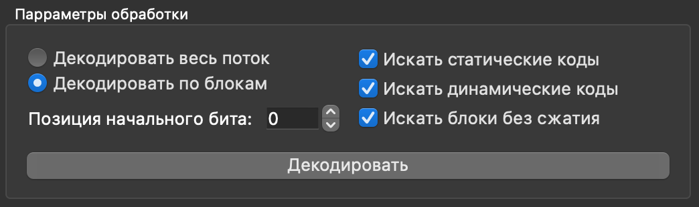
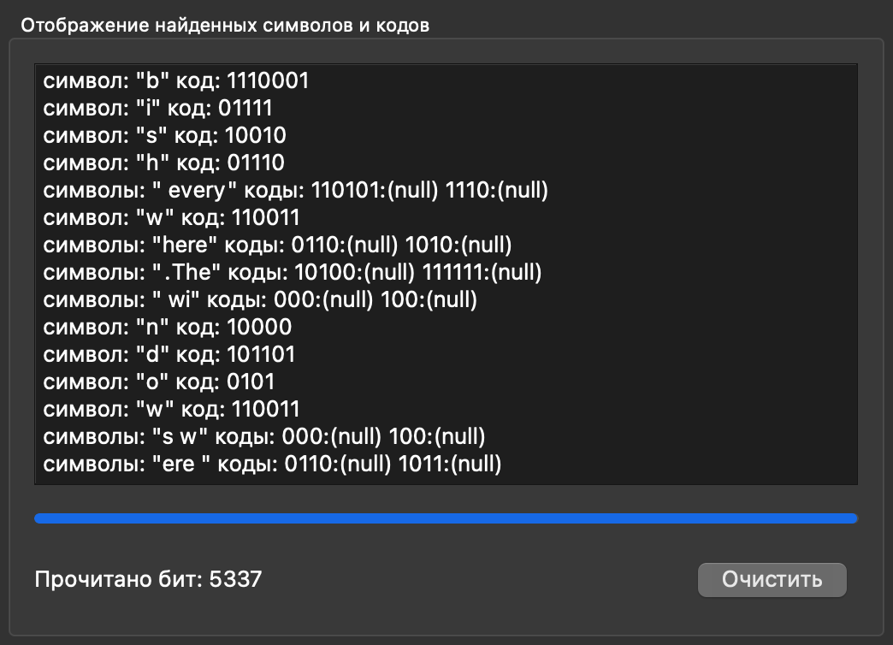
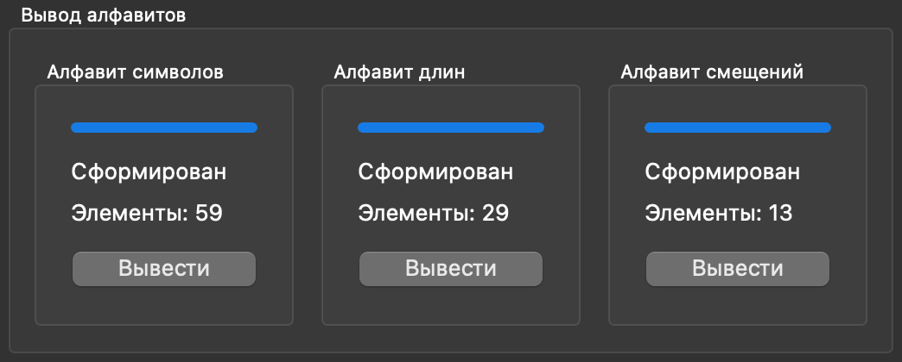
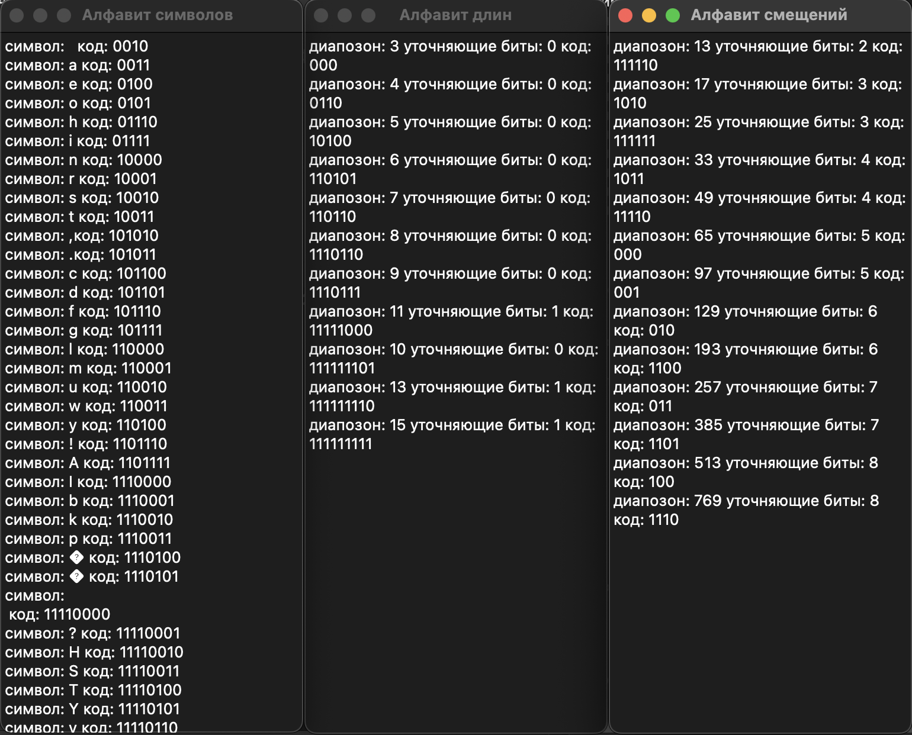

# Deflate compression decoder and analyzer

Deflate compression algorithm decoding and analysis program. The decoding algorithm is carried out according to RFC1951.

## Description

Main window of programm.

The file manager allows you to select a file and displays information about it. The file must be in .sig format (the file consists of packets that begin with two bytes specifying the length of the packet).

Sig viewer. You can choose to display in binary, decimal, hex and text options.

In the decoding options you can choose to process the file as a whole or block by block, what types of compression to process (static, dynamic, no compression) and set the starting bit offset.

After the decoding process is completed, the decoding result will be output.

After processing, alphabets of characters, lengths and offsets will be generated.

You can display them in a separate window by clicking on the corresponding button.

Each dynamic compression block has different alphabets, which depend on the information being compressed.

##
If you have any questions or found some bugs, please text me.